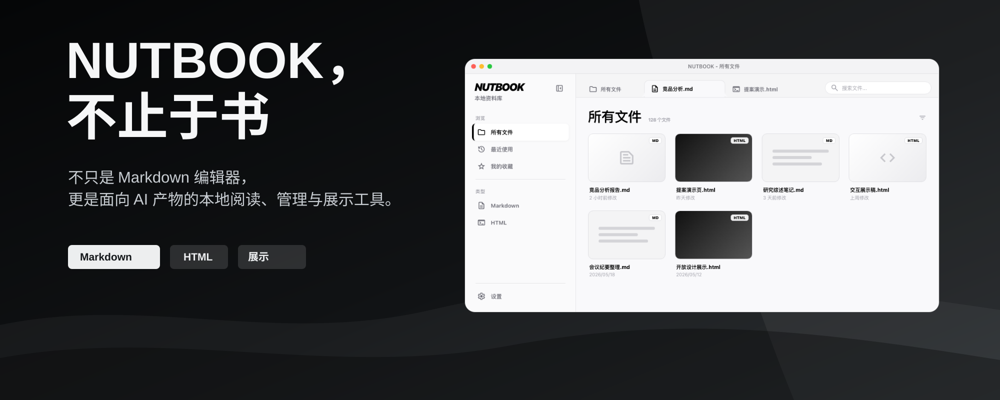

# NUTBOOK

[](https://github.com/Ericonquer/NUTBOOK/actions/workflows/ci.yml)



NUTBOOK 是一个面向 AI 生成内容的本地阅读、管理与展示工具。

它帮助你把分散在电脑里的 Markdown 报告、HTML 演示文档、AI 分析结果和各类 skill 产物统一收纳起来，用更好的阅读体验、更清晰的分类方式和更适合展示的界面，把一次次 AI 输出沉淀成可以反复使用的内容资产。

## 这是什么

现在很多人已经不只是“和 AI 聊天”，而是让 AI 产出真实文件：

* 商业分析报告、竞品研究、市场调研、投融资材料

* 学术论文解读、研究综述、实验分析、课程资料

* 会议提案、项目汇报、HTML 演示页、交互式展示文档

* 由 OpenClaw、Codex、Hermes、Claude Code 等工具和 skill 生成的 Markdown / HTML 文件

这些内容通常质量不错，但落点很散：有的在下载目录，有的在项目文件夹，有的藏在 skill 输出目录里。文件一多，回头找、快速识别、继续阅读、现场展示都会变得麻烦。

NUTBOOK 要解决的就是这个问题：**让 AI 产物从零散文件，变成可阅读、可管理、可展示、可复用的本地资料库。**

## 适合谁

NUTBOOK 不只面向技术用户，更希望服务那些已经开始把 AI 用进真实工作流的人：

* **商业人群**：阅读和整理竞品分析、市场调研、商业计划、客户方案、会议材料。

* **高校与研究人群**：管理论文分析、文献综述、课题资料、学术报告和研究过程产物。

* **内容与策划人群**：沉淀选题分析、脚本草稿、活动方案、展示页和提案材料。

* **AI 高频用户**：统一管理 agent、skill、自动化工作流生成的 Markdown / HTML 文件。

如果你已经有“AI 帮我产出了很多东西，但我回头找不到、看不清、展示不方便”的感觉，NUTBOOK 就是为这个阶段准备的。

## 典型场景

### 阅读一份 AI 生成的竞品分析报告

把 `竞品分析报告.md` 收进 NUTBOOK 后，可以通过缩略图快速识别内容，在更适合阅读的 Markdown 视图中查看结构、表格和重点信息，并用收藏或标签把它归到对应项目下。

### 修改一份学术研究的 AI 分析报告

对于论文解读、研究综述、实验结论等 Markdown 文件，NUTBOOK 提供即时轻编辑能力。你可以在阅读过程中修正 AI 表述、补充引用线索、整理段落，而不必切换到复杂编辑器。

### 在会议或提案中展示 HTML 文档

如果 AI 生成的是 HTML 演示文档，NUTBOOK 可以直接预览和全屏展示。对于带 JavaScript 交互的页面，也可以保留交互效果，更适合现场讲解、项目提案和课堂展示。

## 核心能力

### 1. 内容统一管理

NUTBOOK 会把 AI 产物作为一种独立内容类型来管理，而不是简单套一层文件浏览器。

当前重点支持：

* 接入本地文件夹和单文件

* 接入 skill 产物目录

* 统一管理 Markdown / HTML 内容

* 收藏重要内容

* 用标签进行分类

* 按来源、最近、收藏等方式浏览内容

无论内容来自一个单独的 `.md` 文件，还是来自某个 skill 产物文件夹，都可以被收进同一个本地资料库。

### 2. 强化阅读体验

NUTBOOK 的重点不是“写作软件”，而是让已经生成出来的内容更容易被阅读、识别和继续整理。

当前支持：

* 文件缩略图，方便快速识别报告和演示文档

* 更美观的 Markdown 阅读视图

* Markdown 即时轻编辑

* HTML 页面预览

* 带 JavaScript 交互的 HTML 页面查看

* 对受支持产物进行 HTML 文字和图片轻编辑

* 为可编辑演示页和受支持的纵向 HTML 提供页面导航

它适合阅读 AI 产出的长报告、结构化分析、研究资料和提案文档，也适合在阅读过程中做轻量修订。

### 3. 强化展示能力

很多 AI 产物已经不再只是文本，而是接近“可直接汇报”的 HTML 页面或网页式演示材料。

NUTBOOK 会优先强化这类内容的展示体验：

* HTML 全屏演示

* 保留页面交互

* 适配会议、课堂、提案和复盘场景

* 支持更适合演示的页面打开方式

目标是让 AI 生成的 HTML 不只是“能打开”，而是能真正用于表达、讲解和展示。

### 4. 主动适配内容生成型 skill

NUTBOOK 会主动适配更适合展示和阅读的内容生成型 skill，例如：

* [`html-ppt-skill`](https://github.com/lewislulu/html-ppt-skill)

* [`huashu-design`](https://github.com/alchaincyf/huashu-design)

* [`open-design`](https://github.com/nexu-io/open-design)

* [`guizang-ppt-skill`](https://github.com/op7418/guizang-ppt-skill)

* 其他生成 Markdown / HTML 报告、提案、演示页的 skill

对于这类产物，NUTBOOK 会尽量保留其交互和视觉效果，让它们从“生成文件”变成“可管理、可展示、可复用的作品”。

## 当前支持什么

当前版本已经可以完成一套基础的本地管理闭环：

* Skill 扫描并接入文件夹

* 文件夹扫描录入

* 单文件接入

* Markdown 阅读 / 轻编辑

* HTML 打开与预览

* 支持带 JavaScript 交互的 HTML 页面查看

* 文件缩略图

* 收藏与标签

* 本地文件管理

简单说，当前版本已经适合把常见的 AI 输出文件集中收进来、浏览、筛选、打开、展示和继续整理。

## 安装方式

### 方式一：DMG 安装（推荐）

适合普通使用者。

1. 下载当前发布的 `dmg` 安装包。M1 / M2 / M3 / M4 Mac 请选择 Apple Silicon 版，Intel Mac 请选择 Intel 版。
2. 打开安装包后，把 `NUTBOOK` 拖入 `Applications` 文件夹。
3. 首次打开时，macOS 可能会提示安全限制。

如果遇到“无法打开”或“未受信任开发者”之类的提示，可以这样处理：

1. 打开“系统设置”。
2. 进入“隐私与安全性”。
3. 在底部找到被阻止的应用提示。
4. 选择仍要打开 / 允许打开。

当前 GitHub 构建使用完整的 ad-hoc 签名，因为项目暂未使用付费 Apple Developer ID。macOS 仍会要求用户明确授权，但应用包本身必须通过严格签名校验。如果系统提示 NUTBOOK“已损坏”且没有提供授权入口，请反馈具体安装包名称，不要通过移除 quarantine 属性绕过检查。

### 方式二：源码运行（git clone）

适合开发者、测试者，或希望从源码构建本地版本的用户。

依赖要求：

| 依赖        | 建议版本         | 用途                          |
| --------- | ------------ | --------------------------- |
| Node.js   | 18+          | 安装前端依赖、构建 Markdown 编辑器和前端资源 |
| npm       | 随 Node.js 安装 | 执行前端构建脚本                    |
| Rust      | stable       | 编译 Tauri 后端                 |
| Cargo     | 随 Rust 安装    | 运行 Rust 检查与构建流程             |
| Tauri CLI | 2.x          | 启动或构建桌面应用                   |

```bash
git clone https://github.com/Ericonquer/NUTBOOK.git
cd NUTBOOK
npm install
npm run build:frontend
cargo check --manifest-path src-tauri/Cargo.toml
```

说明：

* Markdown 编辑器构建后会执行兼容补丁，请不要跳过 `npm run build:frontend`。

### 首次录入文件

首次进入空状态后，你可以直接：

* 添加文件夹

* 添加单文件

* 扫描 skill 产物目录

添加完成后，文件列表会出现在主界面中。

### Skill 扫描入口在哪

在设置页中可以看到 **Skill 接入** 相关入口。

它的作用不是“安装 skill”，而是帮助 NUTBOOK 识别和接入已经存在的 skill 产物目录，把这些生成文件纳入统一管理。

### 缩略图引擎说明

如果系统已经具备可用的缩略图引擎，NUTBOOK 会使用它来生成 HTML / Markdown 缩略图。

如果当前没有启用缩略图引擎，应用会优先用默认图标作为占位，并在设置中提示你：

* 检测可用引擎

* 启用系统 Chrome 作为备用方案

* 或按提示安装可用截图引擎

## 常用快捷键

在 macOS 上使用 `Cmd`，在 Windows / Linux 上使用 `Ctrl`。

### 应用通用

| 快捷键                    | 功能             | 适用场景                             |
| ---------------------- | -------------- | -------------------------------- |
| `Cmd/Ctrl + O`         | 添加文件夹          | 将一个本地目录接入 NUTBOOK                |
| `Cmd/Ctrl + Shift + O` | 添加单文件          | 将单个 Markdown / HTML 文件接入 NUTBOOK |
| `Cmd/Ctrl + R`         | 重新扫描当前资料库      | 同步文件夹中的新增、删除或变更                  |
| `Cmd/Ctrl + B`         | 切换侧边栏          | 展开或收起左侧导航区域                      |
| `Cmd/Ctrl + 1`         | 查看所有文件         | 切换到全部内容视图                        |
| `Cmd/Ctrl + 2`         | 查看最近文件         | 切换到最近内容视图                        |
| `Cmd/Ctrl + 3`         | 查看收藏文件         | 切换到收藏内容视图                        |
| `Cmd/Ctrl + Shift + B` | 切换 Markdown 大纲 | 阅读 Markdown 文档时展开或收起大纲           |
| `Esc`                  | 退出演示模式         | HTML 演示或全屏展示时退出                  |

### Markdown 阅读与轻编辑

| 快捷键                    | 功能      | 说明                       |
| ---------------------- | ------- | ------------------------ |
| `Cmd/Ctrl + Z`         | 撤销      | 撤销最近一次 Markdown 编辑       |
| `Cmd/Ctrl + Shift + Z` | 重做      | 恢复刚撤销的 Markdown 编辑       |
| `Cmd/Ctrl + Y`         | 重做      | Windows / Linux 上常见的重做习惯 |
| `Cmd/Ctrl + X`         | 剪切      | 使用系统原生文本编辑能力             |
| `Cmd/Ctrl + C`         | 复制      | 使用系统原生文本编辑能力             |
| `Cmd/Ctrl + V`         | 粘贴      | 使用系统原生文本编辑能力             |
| `Cmd/Ctrl + A`         | 全选      | 选中当前编辑区域内容               |
| `Enter`                | 应用链接    | 在链接输入框中确认插入或修改链接         |
| `Esc`                  | 关闭链接输入框 | 放弃当前链接输入并回到编辑器           |

Markdown 的加粗、斜体、行内代码、删除线、链接、标题和表格操作目前主要通过阅读区内的悬浮工具栏完成。

### HTML 演示

| 快捷键       | 功能        | 说明                                                |
| --------- | --------- | ------------------------------------------------- |
| `F`       | 切换全屏展示    | 在 HTML 预览或 runtime 中进入 / 退出窗口级全屏                  |
| `Esc`     | 退出全屏展示    | 当前 HTML 处于全屏展示时退出                                 |
| `S`       | 触发演示者模式   | 适用于支持 presenter mode 的 HTML 产物，例如部分 `html-ppt` 输出 |
| `←` / `→` | 上一页 / 下一页 | 传递给 HTML 页面自身，适用于支持键盘翻页的演示文档                      |
| `↑` / `↓` | 上一段 / 下一段 | 传递给 HTML 页面自身，具体行为由 HTML 页面决定                     |
| `Space`   | 下一步或播放控制  | 传递给 HTML 页面自身，适用于支持空格操作的演示文档                      |

HTML 快捷键会优先交给当前打开的 HTML 页面处理。对于 `html-ppt`、`huashu-design`、`open-design` 等可交互产物，页面自身的键盘交互也会尽量保留。

## 产品边界

NUTBOOK 目前仍是一个 MVP，重点非常聚焦：

* 重点是“阅读、管理与展示”，不是重型知识库

* 暂不追求复杂协作、云同步、RAG 等能力

* 更适合个人、本地工作流或小团队轻量使用

* 不替代 AI 工具本身，而是承接 AI 工具生成后的内容管理环节

* HTML 编辑以明确协议和内容微调为边界，不承担任意视觉布局创作

也就是说，当前版本更像一个“AI 产物整理台”和“本地展示资料库”，而不是一个完整的团队内容平台。

## 0.6：HTML 轻编辑

NUTBOOK 0.6 为受支持的 AI 生成 HTML 增加了轻编辑能力，同时保留原始产物和页面自身的运行行为。

* 在 HTML runtime 中直接修改带协议标记的普通文本和富文本。

* 替换、裁切、移动和新增图片，并支持撤销与重做。

* 通过页面导航切换可编辑演示页或受支持的纵向 HTML 页面。

* 通过带会话校验的保存流程完成保存、关闭和重开恢复。

* 普通 HTML 会生成同目录 `.nutbook-editable.html` 副本，不会改写原文件。

HTML 编辑刻意保持轻量。NUTBOOK 不会扩展成通用可视化页面搭建器；响应式布局重构、任意组件拖动、页面结构调整、表格结构编辑和代码块创作，更适合交给原始生成工具或前置 AI 修订流程。

## 下一步计划

接下来会继续沿着“让 AI 产物更容易发现、阅读、展示、沉淀和复用”这个方向往前推：

| 状态 | 方向 | 目标 |
| --- | --- | --- |
| 已实现 | **Markdown 轻编辑** | 在阅读过程中直接修订生成的 Markdown，并提供格式、历史、保存和恢复能力。 |
| 已实现 | **HTML 轻编辑** | 在保留原始产物和页面运行行为的前提下，修改带协议标记的文字与图片。 |
| 下一步 | **Agent 项目产物发现** | 从 agent 项目目录中发现有价值的 Markdown、HTML 及相关输出，并接入本地资料库。 |
| 下一步 | **NBSkill 协议约束** | 明确 NUTBOOK 消费 skill 产物时所需的元数据、目录、身份和生命周期契约。 |
| 下一步 | **Markdown 导出中心** | 将 Markdown 导出为阅读型或演示型 HTML，再逐步扩展 PDF、长图和水印。 |
| 下一步 | **HTML 原生演示模式** | 为适合演示的 HTML 产物提供由 NUTBOOK 控制、导航确定且行为稳定的演示运行面。 |
| 下一步 | **演示画笔工具** | 为演示、会议、课堂、提案和评审提供临时屏幕圈划能力。 |
| 下一步 | **AI 功能开发** | 在文件安全和确定性编辑边界清晰的前提下，逐步加入 AI 辅助发现、理解和修订能力。 |

这些方向的共同目标只有一个：让 AI 产物不只是“生成出来”，而是更容易被看见、讲清、整理和再次使用。

## 常见问题

**Q：NUTBOOK 是不是知识库？**

不是。当前版本更偏向本地 AI 产物的阅读、展示、整理和沉淀。

**Q：能不能管理普通文件？**

可以接入本地文件夹和单文件，但当前设计重点还是 AI 工具生成的 Markdown / HTML 产物。

**Q：现在适合团队大规模协作吗？**

暂时不建议。当前版本更适合个人、本地工作流或小团队轻量使用。

**Q：它和 AI 工具是什么关系？**

AI 工具负责生成内容，NUTBOOK 负责承接生成后的内容：阅读、修改、分类、收藏、预览和展示。

## License

NUTBOOK is licensed under the Apache License 2.0. See [LICENSE](./LICENSE) for details.

Third-party dependency notices are listed in [THIRD\_PARTY\_LICENSES.md](./THIRD_PARTY_LICENSES.md).
