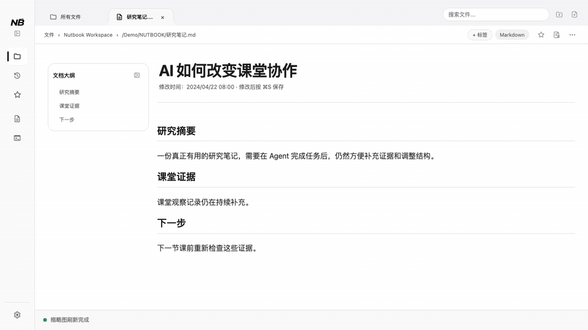
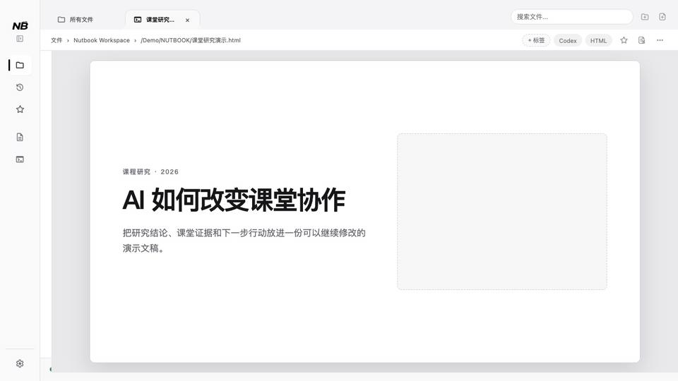
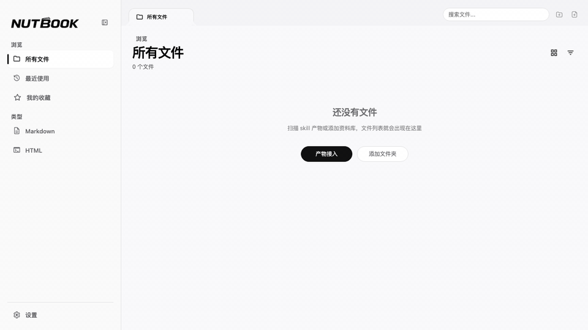

[](./assets/app-icon.png)

# NUTBOOK

**面向 AI 生成内容的本地阅读、管理与展示工具。**

[](https://github.com/Ericonquer/NUTBOOK/actions/workflows/ci.yml) · [下载最新版](https://github.com/Ericonquer/NUTBOOK/releases/latest) · [English](./README.md)


<https://github.com/user-attachments/assets/45dcfef4-44c4-4ec1-888a-c47404995a72>

## 这是什么

AI 已经不只是在聊天窗口里回答问题。它开始交付真实文件：研究报告、课程资料、竞品分析、客户方案、Markdown 文档、HTML 演示页，以及 Agent 项目和任务中的阶段成果。

但这些内容通常散落在下载目录、项目文件夹、隐藏目录、任务记录和 Skill 输出目录里。刚生成时也许还能找到，过一段时间、项目和对话一多，就很难记起“它是哪次任务生成的、保存在哪里、哪个才是最终版本”。

NUTBOOK 把这些零散的 AI 产物收进一个本地资料库，让它们变得：

* **更容易找到**：跨 Agent、项目、任务、Skill、文件夹和单文件发现并接入值得保留的成果。
* **更适合阅读**：用缩略图和专门的 Markdown / HTML 阅读界面快速识别内容。
* **可以继续修改**：在阅读过程中轻编辑 Markdown，以及受支持 HTML 中的文字和图片。
* **能够直接展示**：保留 HTML 页面自身的交互，并用于会议、提案、课堂和评审。
* **始终留在本机**：文件系统是真实状态源，NUTBOOK 不把资料库变成云端内容平台。

简单说，NUTBOOK 要做的是：**让 AI 产物从零散文件，变成可阅读、可管理、可展示、可复用的本地资料库。**

## Agent 已经有“产物”列表，为什么还需要 NUTBOOK

Codex 等 Agent 工具可以在当前任务或对话旁展示产物，这很适合继续眼前的工作。但当任务、项目和 Agent 越来越多，回头寻找某份成果时，你仍然需要先想起“它来自哪次对话”，再到大量历史记录中逐个查找。

两者关注的是不同阶段：

* **Agent 工具围绕生成过程工作**：理解需求、执行任务、修改文件并交付结果。
* **NUTBOOK 围绕最终产物工作**：跨对话、任务、项目和 Agent，把值得再次阅读、修改与展示的成果放进同一个本地资料库。

NUTBOOK 不替代 Agent，也不管理 Agent 的执行过程。Agent 项目和任务在 NUTBOOK 中是产物来源与发现范围，真正进入资料库的是适合阅读和展示的 Markdown / HTML 成果，而不是项目里的所有文件。

## 如果你正在这些场景里使用 AI

### 如果你是一位老师

你可能会让 Agent 准备课程讲义、课堂案例或 HTML 演示。AI 告诉你文件已经生成，但它可能藏在多层项目目录或某次任务记录里。NUTBOOK 可以发现这些成果，让你确认后收进资料库；以后不必重新翻对话或找目录，就能直接阅读、修改并用于课堂展示。

### 如果你是一位研究员或学生

论文解读、文献综述、实验分析和阶段报告会随着研究不断增加。NUTBOOK 可以把不同任务生成的 Markdown / HTML 资料集中起来，通过缩略图、标签、来源和最近记录重新找到它们，并在阅读过程中继续修订。

### 如果你从事商业、咨询或策划工作

竞品分析、市场调研、客户方案和提案演示往往不是“生成完就结束”。你还需要校对文字、替换图片、整理重点，并在会议中讲清楚。NUTBOOK 承接生成后的这一段工作，让报告和 HTML 提案可以继续修改、管理与展示。

### 如果你经常使用不同的 Agent 和内容生成 Skill

Codex、Claude Code、OpenClaw、Hermes、WorkBuddy 和各类 Skill 可能把成果放在不同位置。NUTBOOK 提供一个跨来源的本地成果层，让你不必理解隐藏目录、manifest 或项目内部结构，也能持续沉淀真正有用的内容。

## NUTBOOK 如何承接一份 AI 产物

**发现与接入 → 阅读与轻编辑 → 分类管理 → 展示与复用**

1. 从 Agent 项目和任务、Skill 输出目录、本地文件夹或单文件中找到成果。
2. 由用户确认接入范围，不静默导入整个项目。
3. 在 NUTBOOK 中阅读 Markdown 或运行交互式 HTML，并做必要的轻量修改。
4. 通过缩略图、标签、收藏、来源和最近记录管理内容。
5. 在会议、课堂、提案和评审中重新打开、全屏展示或继续使用。

## 核心能力

### 1. 多来源产物接入

NUTBOOK 管理的是值得阅读和展示的 AI 产物，不是项目里的每一个文件。

当前接入方式包括：

* 添加本地文件夹或单个 Markdown / HTML 文件。
* 扫描内容生成型 Skill 声明或常用的产物目录。
* 发现 Codex、Claude Code、OpenClaw、Hermes 和 WorkBuddy 的 Agent 项目及任务产物。
* 通过 nbskill manifest 保留产物身份、来源、生命周期和受支持的 HTML 编辑能力。
* 启用经过明确确认的 Agent 集成，让 Agent 可以按协议登记产物。
* 使用 Nutbook CLI 在桌面应用运行或退出时接入和移除文件、文件夹或 Agent 项目。

### 2. Markdown / HTML 阅读与轻编辑

NUTBOOK 的重点不是重型创作，而是在阅读过程中完成真正需要的修订。

* Markdown 阅读、大纲、格式工具、表格操作、撤销/重做、保存与恢复。
* 带 JavaScript 交互的 HTML runtime，不把可运行 HTML 降级成普通静态预览。
* 对受支持 HTML 修改文字与富文本，替换、裁切、移动或新增图片。
* 为可编辑演示页和受支持的纵向 HTML 提供页面导航。
* 普通 HTML 会创建同目录 `.nutbook-editable.html` 副本，保护原始文件。

下面演示 Markdown 的大纲导航、实时编辑、文字格式和图片插入与对齐：



### 3. 本地资料库管理

* 用文件缩略图快速识别报告、演示页和长文档。
* 通过收藏、自定义标签、Skill 标签和类型标签整理内容。
* 按所有文件、最近使用、收藏、类型和来源浏览。
* 分别管理文件夹来源、单文件来源和 Agent 项目来源。
* 以磁盘文件为真实状态源，同步处理外部新增、变更和删除。

### 4. HTML 展示与演示

* 保留页面自身的 JavaScript 交互和视觉行为。
* 使用窗口级全屏展示 HTML。
* 支持页面自身的键盘翻页、演示者模式和播放控制。
* 对受支持的演示型与纵向 HTML 提供确定的页面导航。

目标不是让 HTML “能打开”，而是让 AI 生成的页面真正可以用于讲解、提案、课堂和评审。

下面演示演示型 HTML 的原生文字修改、标题格式、新建图片框和保存：



## 当前支持

| 领域 | 当前支持 | 边界说明 |
| --- | --- | --- |
| 产物来源 | 单文件、文件夹、Skill 输出、Agent 项目与任务、nbskill manifest、Nutbook CLI | 只接入适合阅读和展示的产物，不导入项目全部文件 |
| Agent 范围 | Codex、Claude Code、OpenClaw、Hermes、WorkBuddy 的有界项目适配器 | 项目发现、Agent 检测和集成健康状态分别判断，不用一个图标代替真实验证 |
| 内容格式 | `.md`、`.markdown`、`.html`、`.htm` | 当前不是通用文件管理器 |
| Markdown | 阅读、大纲、轻编辑、格式、表格、历史、保存与恢复 | Milkdown 是主体验，同时保留源码编辑 fallback |
| HTML | 交互式运行、全屏、文字/富文本/图片轻编辑、受支持页面导航 | 原生编辑能力取决于内容能力；普通 HTML 走可编辑副本 |
| 资料库 | 缩略图、收藏、标签、最近、类型筛选、来源管理、外部文件同步 | 文件系统是真实状态源，数据库是索引和缓存 |
| 展示 | HTML 交互、窗口级全屏、页面自身的演示快捷键 | NUTBOOK 尽量保留原页面行为，不承诺重写任意页面逻辑 |
| 数据位置 | 本地文件、本地索引、本地集成 | 当前不提供云同步、在线协作或 RAG 知识库 |

## 第一次使用 NUTBOOK

下面演示从空资料库启用 Agent 集成，并发现 Agent 项目和 Skill 产物目录。扫描结果使用隔离示例数据，不包含真实用户资料：



### 1. 下载并安装

1. 前往 [GitHub Releases](https://github.com/Ericonquer/NUTBOOK/releases/latest)，找到最新版本。
2. 根据 Mac 芯片选择对应安装包：M1 / M2 / M3 / M4 等请选择 Apple Silicon，Intel Mac 请选择 Intel。
3. 下载 DMG，打开后将 `NUTBOOK` 拖入 `Applications`（应用程序）文件夹。

### 2. 完成 macOS 首次授权

当前 GitHub 构建使用完整的 ad-hoc 签名，尚未使用付费 Apple Developer ID。第一次打开时，macOS 可能提示无法验证开发者：

1. 打开“系统设置”。
2. 进入“隐私与安全性”。
3. 在底部找到 NUTBOOK 的拦截提示。
4. 选择“仍要打开”或“允许打开”。

如果系统提示应用“已损坏”并且没有提供授权入口，请反馈具体安装包名称，不要通过移除 quarantine 属性绕过检查。

### 3. 从空资料库进入“产物接入”

第一次打开空资料库时，应用会停留在“所有文件”Tab。在界面中央点击 **产物接入**，进入“设置 → 产物接入”。

这里有两个不同区域：

* 页面顶部右侧的 **Agent 集成** Banner：启用、管理或修复经过可靠检测的 Agent 集成。
* 下方的 **项目产物接入**：发现已有 Agent 项目和任务中的建议、备选和已接入产物。

### 4. 启用 Agent 集成

在顶部右侧 Agent 集成 Banner 中选择已检测到的 Agent，点击 **启用 Agent 集成**，并在确认框中核对本次修改的准确范围。

NUTBOOK 只修改经过保守检测、由用户明确勾选的集成范围；不会修改 `PATH`，不会用符号链接部署，也不会覆盖无法确认所有权的文件或静默降级更高版本。

### 5. 用一句话把成果接入 NUTBOOK

回到已经启用集成的 Agent，可以直接说：

> 把这份成果接入 NUTBOOK。

Agent 可以通过 nbskill 登记产物身份与编辑能力，并在你明确要求接入时使用 Nutbook CLI。你不需要自己寻找隐藏目录、复制长路径或理解 manifest。

带完整 NUTBOOK HTML 编辑协议的产物可以直接获得原生轻编辑能力；没有协议的普通 HTML 仍可通过同目录可编辑副本安全修改。

### 不启用 Agent 集成也可以使用

* 在“项目产物接入”中发现已有 Agent 项目和任务成果，确认后手动接入。
* 直接添加本地文件夹。
* 直接添加一个 Markdown / HTML 文件。
* 在“skill 产物接入”中管理内容生成型 Skill 的输出目录。

## 更多接入与运行方式

### Nutbook CLI

NUTBOOK 会把随应用提供的 CLI 部署到应用数据目录，但不会自动加入 `PATH`：

* macOS：`~/Library/Application Support/com.hayley.nutbook/cli/nutbook`
* Windows：`%LOCALAPPDATA%\com.hayley.nutbook\cli\nutbook.exe`

每个修改状态的命令只接受一个路径：

```text
nutbook add <path> [--json]
nutbook remove <path> [--json]
nutbook add-project <path> [--json]
nutbook remove-project <path> [--json]
nutbook doctor [--json]
```

`doctor` 只读。文件和文件夹操作支持与 NUTBOOK 相同的 Markdown / HTML 格式，并且永远不会删除源文件。

### 从源码运行

适合开发者、测试者，或希望本地构建的人。

| 依赖 | 建议版本 | 用途 |
| --- | --- | --- |
| Node.js | 18+ | 安装前端依赖、构建 Markdown 编辑器和前端资源 |
| npm | 随 Node.js 安装 | 执行前端构建脚本 |
| Rust / Cargo | stable | 编译和检查 Tauri 后端 |
| Tauri CLI | 2.x | 启动或构建桌面应用 |

```bash
git clone https://github.com/Ericonquer/NUTBOOK.git
cd NUTBOOK
npm install
npm run build:frontend
cargo check --manifest-path src-tauri/Cargo.toml
```

Markdown 编辑器构建会执行兼容补丁，请不要跳过 `npm run build:frontend`。

### 缩略图引擎

如果系统具备可用的缩略图引擎，NUTBOOK 会用它生成 HTML / Markdown 缩略图。如果没有启用引擎，应用会使用默认占位图，并在设置中允许你检测可用引擎、明确启用系统 Chrome 备用方案，或按提示安装截图引擎。NUTBOOK 不会静默调用 Chrome。

## 常用快捷键

macOS 使用 `Cmd`，Windows / Linux 使用 `Ctrl`。

### 应用通用

| 快捷键 | 功能 | 适用场景 |
| --- | --- | --- |
| `Cmd/Ctrl + O` | 添加文件夹 | 将一个本地目录接入 NUTBOOK |
| `Cmd/Ctrl + Shift + O` | 添加单文件 | 接入一个 Markdown / HTML 文件 |
| `Cmd/Ctrl + R` | 重新扫描当前资料库 | 同步文件夹中的新增、删除和变更 |
| `Cmd/Ctrl + B` | 切换侧边栏 | 展开或收起左侧导航 |
| `Cmd/Ctrl + 1` | 所有文件 | 切换到全部内容视图 |
| `Cmd/Ctrl + 2` | 最近使用 | 切换到最近内容视图 |
| `Cmd/Ctrl + 3` | 我的收藏 | 切换到收藏视图 |
| `Cmd/Ctrl + Shift + B` | Markdown 大纲 | 阅读 Markdown 时展开或收起大纲 |

### Markdown 阅读与轻编辑

| 快捷键 | 功能 | 说明 |
| --- | --- | --- |
| `Cmd/Ctrl + Z` | 撤销 | 撤销最近一次 Markdown 编辑 |
| `Cmd/Ctrl + Shift + Z` | 重做 | 恢复刚撤销的编辑 |
| `Cmd/Ctrl + Y` | 重做 | Windows / Linux 常用习惯 |
| `Cmd/Ctrl + X/C/V/A` | 剪切、复制、粘贴、全选 | 使用系统原生文本编辑能力 |
| `Enter` | 应用链接 | 在链接输入框中确认 |
| `Esc` | 关闭链接输入框 | 放弃链接输入并回到编辑器 |

加粗、斜体、行内代码、删除线、链接、标题和表格等操作主要通过阅读区内的悬浮工具栏完成。

### HTML 演示

| 快捷键 | 功能 | 说明 |
| --- | --- | --- |
| `F` | 切换全屏展示 | 在 HTML runtime 中进入或退出窗口级全屏 |
| `S` | 触发演示者模式 | 适用于页面自身支持 presenter mode 的产物 |
| `←` / `→` | 上一页 / 下一页 | 交给当前 HTML 页面处理 |
| `↑` / `↓` | 上一段 / 下一段 | 具体行为由页面决定 |
| `Space` | 下一步或播放控制 | 适用于支持空格操作的页面 |

HTML 快捷键会优先交给当前打开的页面。编辑状态下会保护文字输入，避免裸 `f/F` 演示快捷键干扰输入。

## 产品边界

NUTBOOK 仍然保持聚焦：

* 核心是本地 AI 产物的阅读、管理与展示，不是重型知识库。
* 不追求复杂协作、云同步或 RAG。
* 不替代 AI 工具，而是承接 AI 工具生成后的内容。
* Agent 项目和任务是产物来源，不是 NUTBOOK 要管理的执行流程。
* HTML 编辑以内容微调为边界，不承担任意页面搭建、响应式布局重构或通用代码编辑。
* 更适合个人、本地工作流，以及小团队中的轻量展示与资料传递。

NUTBOOK 更像一个“AI 产物整理台”和“本地展示资料库”，而不是团队内容平台或开发 IDE。

## 版本更新

### 0.8.0：从手动找文件，到接入 Agent 项目与任务产物

0.8.0 让 NUTBOOK 可以更直接地承接 Agent 生成的成果，同时保持所有修改由用户明确触发并留在本机：

* 通过保守、有界的适配器发现 Codex、Claude Code、OpenClaw、Hermes 和 WorkBuddy 的项目与任务产物。
* 在接入前分别查看建议、备选和已经接入的成果。
* 使用 nbskill manifest 保留产物身份、来源、生命周期和 HTML 编辑能力。
* 在同一确认流程中启用、修复、管理或移除经过验证的 Agent 集成。
* 使用 Nutbook CLI 接入或移除文件、文件夹和 Agent 项目，并执行只读健康检查。
* 保留无 nbskill 的基础发现路径，不让增强能力成为接入的单点依赖。

### 0.6.0：从 HTML 展示，到 HTML 轻编辑

0.6.0 为受支持的 AI 生成 HTML 增加了轻编辑能力，同时保留原始产物与页面自身行为：

* 在 HTML runtime 中修改普通文本与富文本。
* 替换、裁切、移动和新增图片，并支持撤销与重做。
* 通过页面导航切换可编辑演示页或受支持的纵向内容。
* 使用带会话校验的保存流程完成保存、关闭和重开恢复。
* 普通 HTML 生成同目录 `.nutbook-editable.html` 副本，不改写原文件。

## 开发进展与计划

| 状态 | 方向 | 阶段成果或目标 |
| --- | --- | --- |
| 已实现 | **Markdown 轻编辑** | 在阅读过程中修订生成的 Markdown，并提供格式、表格、历史、保存和恢复能力。 |
| 已实现 | **HTML 轻编辑** | 在保留原始产物与页面行为的前提下，修改受支持的文字、富文本与图片。 |
| 已实现 | **Agent 项目与任务产物接入** | 从单文件、文件夹和 Skill 目录，扩展到 Agent 项目与任务成果的发现、确认和来源管理。 |
| 已实现 | **Agent 集成** | 通过 nbskill 登记产物身份、生命周期和 HTML 编辑协议，并明确管理经过验证的 Agent 安装。 |
| 已实现 | **Nutbook CLI** | 在桌面应用运行或退出时接入和移除文件、文件夹与 Agent 项目，并提供只读健康检查。 |
| 下一步 | **Markdown 导出中心** | 将 Markdown 导出为阅读型或演示型 HTML，再逐步扩展 PDF、长图和水印。 |
| 下一步 | **HTML 原生演示模式** | 为演示型 HTML 提供由 NUTBOOK 控制、导航确定且行为稳定的演示运行面。 |
| 下一步 | **演示画笔工具** | 为课堂、会议、提案和评审提供临时屏幕圈划能力。 |
| 探索中 | **AI 辅助能力** | 在本地文件安全和确定性编辑边界清晰后，帮助发现、理解和修订内容。 |

这些阶段共同指向一个目标：让 AI 产物不只是“生成出来”，而是更容易被找到、看懂、修改、讲清和再次使用。

## 常见问题

**NUTBOOK 是不是知识库？**

不是。当前版本更偏向本地 AI 产物的发现、阅读、轻编辑、整理和展示。

**能不能管理普通文件？**

可以接入本地文件夹和单文件，但当前支持格式与产品重点仍是 AI 工具生成的 Markdown / HTML 产物。

**启用 Agent 集成后，会导入整个项目吗？**

不会。Agent 项目是发现范围，NUTBOOK 只呈现符合产物边界的候选，并由用户确认接入。

**HTML 是不是都能直接编辑？**

所有普通 HTML 都可以走保留原文件的可编辑副本路径；带完整 NUTBOOK 编辑协议的内容可以原生编辑。NUTBOOK 不承诺任意网页的布局和脚本都可以可视化修改。

**现在适合团队大规模协作吗？**

暂时不建议。当前更适合个人、本地工作流或小团队轻量使用。

**它和 AI 工具是什么关系？**

AI 工具负责生成和修改内容，NUTBOOK 负责承接生成后的成果：发现、接入、阅读、分类、收藏、轻编辑和展示。

## License

NUTBOOK is licensed under the Apache License 2.0. See [LICENSE](./LICENSE) for details.

Third-party dependency notices are listed in [THIRD_PARTY_LICENSES.md](./THIRD_PARTY_LICENSES.md).
