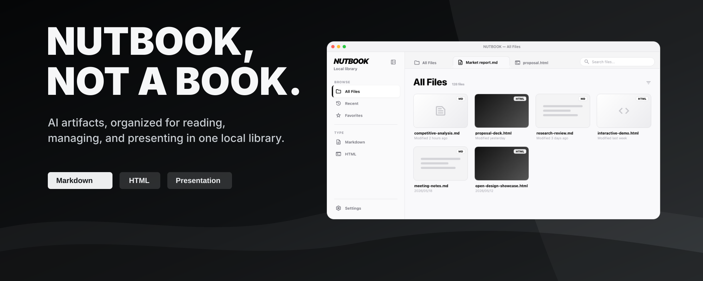

# NUTBOOK



NUTBOOK is a local reading, management, and presentation tool for AI-generated content.

It helps you bring scattered Markdown reports, HTML presentation documents, AI analysis results, and skill-generated artifacts into one local library. With a better reading experience, clearer organization, and presentation-friendly viewing, NUTBOOK turns one-off AI outputs into reusable content assets.

中文版请见 [README-CN.md](./README-CN.md)。

## What Is It

Many people are no longer just chatting with AI. They are asking AI to produce real files:

* Business analysis reports, competitor research, market research, and fundraising materials

* Academic paper summaries, literature reviews, experiment analysis, and course materials

* Meeting proposals, project presentations, HTML slides, and interactive showcase documents

* Markdown / HTML files generated by OpenClaw, Codex, Hermes, Claude Code, and other tools or skills

These outputs are often useful, but they tend to land everywhere: downloads folders, project folders, or skill output directories. As the number grows, it becomes harder to find them again, identify them quickly, continue reading, or present them live.

NUTBOOK solves this problem: **it turns scattered AI artifacts into a local library that is readable, manageable, presentable, and reusable.**

## Who It Is For

NUTBOOK is not only for technical users. It is designed for people who are already bringing AI into real workflows:

* **Business users:** read and organize competitor analysis, market research, business plans, client proposals, and meeting materials.

* **Researchers and students:** manage paper analysis, literature reviews, project materials, academic reports, and research artifacts.

* **Content and planning teams:** collect topic analysis, script drafts, campaign plans, showcase pages, and proposal materials.

* **Heavy AI users:** manage Markdown / HTML outputs generated by agents, skills, and automation workflows.

If you have ever felt that “AI generated a lot of useful things, but I cannot find, read, or present them easily later,” NUTBOOK is built for that stage.

## Typical Use Cases

### Read an AI-Generated Competitor Analysis Report

After adding `competitor-analysis.md` to NUTBOOK, you can identify it quickly from its thumbnail, read its structure, tables, and key points in a more comfortable Markdown view, and organize it with favorites or tags under the right project.

### Edit an AI Analysis Report for Academic Research

For Markdown files such as paper summaries, literature reviews, and experiment conclusions, NUTBOOK provides lightweight inline editing. You can correct AI wording, add citation clues, and reorganize paragraphs while reading, without switching to a heavy editor.

### Present an HTML Document in a Meeting or Proposal

If AI generates an HTML presentation document, NUTBOOK can preview and present it fullscreen. For pages with JavaScript interaction, NUTBOOK tries to preserve the original interactive behavior, making them more suitable for live demos, proposals, and classroom presentations.

## Core Capabilities

### 1. Unified Content Management

NUTBOOK treats AI artifacts as first-class content, not as files inside a thin file browser.

Current focus:

* Add local folders and individual files

* Add skill artifact directories

* Manage Markdown / HTML content in one place

* Favorite important items

* Organize content with tags

* Browse by source, recency, favorites, and other views

Whether the content is a standalone `.md` file or a skill output folder, it can be collected into the same local library.

### 2. Better Reading Experience

NUTBOOK is not trying to be a full writing suite. Its focus is to make generated content easier to read, identify, and refine.

Current support:

* File thumbnails for quickly recognizing reports and presentation documents

* A cleaner Markdown reading view

* Lightweight Markdown editing

* HTML page preview

* Viewing HTML pages with JavaScript interaction

It is suitable for long AI-generated reports, structured analysis, research notes, proposal documents, and light revisions during reading.

### 3. Better Presentation Experience

Many AI artifacts are no longer plain text. Some are close to presentation-ready HTML pages or web-style showcase documents.

NUTBOOK prioritizes this kind of presentation experience:

* Fullscreen HTML presentation

* Preserved page interaction

* Meeting, classroom, proposal, and review scenarios

* Presentation-friendly ways to open generated pages

The goal is to make AI-generated HTML not just “openable,” but genuinely usable for explaining, presenting, and discussing ideas.

### 4. Skill Artifact Support

NUTBOOK actively adapts to content-generation skills that produce readable or presentable artifacts, such as:

* [`html-ppt-skill`](https://github.com/lewislulu/html-ppt-skill)

* [`huashu-design`](https://github.com/alchaincyf/huashu-design)

* [`open-design`](https://github.com/nexu-io/open-design)

* [`guizang-ppt-skill`](https://github.com/op7418/guizang-ppt-skill)

* Other skills that generate Markdown / HTML reports, proposals, or presentation pages

For these artifacts, NUTBOOK tries to preserve their interaction and visual behavior, turning them from “generated files” into manageable, presentable, reusable works.

## Current Support

The current version already supports a basic local management workflow:

* Skill scanning and folder intake

* Folder scanning

* Single-file intake

* Markdown reading / lightweight editing

* HTML opening and preview

* Viewing HTML pages with JavaScript interaction

* File thumbnails

* Favorites and tags

* Local file management

In short, the current version is already suitable for collecting, browsing, filtering, opening, presenting, and lightly organizing common AI output files.

## Installation

### Option 1: DMG Installation (Recommended)

Recommended for regular users.

1. Download the current `dmg` installer.
2. Open the installer and drag `NUTBOOK` into the `Applications` folder.
3. On first launch, macOS may show a security warning.

If you see a warning such as “cannot be opened” or “unidentified developer,” you can usually handle it this way:

1. Open System Settings.
2. Go to Privacy & Security.
3. Find the blocked app notice near the bottom.
4. Choose Open Anyway / Allow.

### Option 2: Run from Source (git clone)

Recommended for developers, testers, or users who want to build a local version from source.

Requirements:

| Dependency | Recommended Version  | Purpose                                                                   |
| ---------- | -------------------- | ------------------------------------------------------------------------- |
| Node.js    | 18+                  | Install frontend dependencies and build Markdown editor / frontend assets |
| npm        | Bundled with Node.js | Run frontend build scripts                                                |
| Rust       | stable               | Compile the Tauri backend                                                 |
| Cargo      | Bundled with Rust    | Run Rust checks and build flows                                           |
| Tauri CLI  | 2.x                  | Run or build the desktop app                                              |

```bash
git clone https://github.com/Ericonquer/NUTBOOK.git
cd NUTBOOK
npm install
npm run build:frontend
cargo check --manifest-path src-tauri/Cargo.toml
```

Notes:

* The Markdown editor build runs a compatibility patch. Do not skip `npm run build:frontend`.

### First-Time File Intake

On first launch, if the library is empty, you can directly:

* Add a folder

* Add a single file

* Scan skill artifact directories

After adding content, the file list will appear in the main interface.

### Where Is Skill Scanning?

In Settings, you can find the **Skill Integration** entry.

It does not install skills. Instead, it helps NUTBOOK recognize and add existing skill artifact directories so generated files can be managed in one place.

### Thumbnail Engine

If a usable thumbnail engine is available, NUTBOOK uses it to generate HTML / Markdown thumbnails.

If no thumbnail engine is currently enabled, the app falls back to default placeholder icons and prompts you in Settings to:

* Detect available engines

* Enable system Chrome as a fallback

* Or follow the instructions to install an available screenshot engine

## Keyboard Shortcuts

Use `Cmd` on macOS and `Ctrl` on Windows / Linux.

### General

| Shortcut               | Action                  | Context                                         |
| ---------------------- | ----------------------- | ----------------------------------------------- |
| `Cmd/Ctrl + O`         | Add folder              | Add a local directory to NUTBOOK                |
| `Cmd/Ctrl + Shift + O` | Add single file         | Add one Markdown / HTML file to NUTBOOK         |
| `Cmd/Ctrl + R`         | Rescan current library  | Sync added, removed, or changed files           |
| `Cmd/Ctrl + B`         | Toggle sidebar          | Expand or collapse the left navigation          |
| `Cmd/Ctrl + 1`         | View all files          | Switch to the all-content view                  |
| `Cmd/Ctrl + 2`         | View recent files       | Switch to the recent-content view               |
| `Cmd/Ctrl + 3`         | View favorites          | Switch to the favorites view                    |
| `Cmd/Ctrl + Shift + B` | Toggle Markdown outline | Show or hide the outline while reading Markdown |
| `Esc`                  | Exit presentation mode  | Exit HTML presentation or fullscreen display    |

### Markdown Reading and Lightweight Editing

| Shortcut               | Action           | Notes                                                  |
| ---------------------- | ---------------- | ------------------------------------------------------ |
| `Cmd/Ctrl + Z`         | Undo             | Undo the latest Markdown edit                          |
| `Cmd/Ctrl + Shift + Z` | Redo             | Redo the latest undone Markdown edit                   |
| `Cmd/Ctrl + Y`         | Redo             | Common redo shortcut on Windows / Linux                |
| `Cmd/Ctrl + X`         | Cut              | Use native text editing behavior                       |
| `Cmd/Ctrl + C`         | Copy             | Use native text editing behavior                       |
| `Cmd/Ctrl + V`         | Paste            | Use native text editing behavior                       |
| `Cmd/Ctrl + A`         | Select all       | Select the current editing area                        |
| `Enter`                | Apply link       | Confirm link insertion or editing in the link input    |
| `Esc`                  | Close link input | Cancel the current link input and return to the editor |

Bold, italic, inline code, strikethrough, links, headings, and table operations are currently handled mainly through the floating toolbar in the reading area.

### HTML Presentation

| Shortcut  | Action                         | Notes                                                                           |
| --------- | ------------------------------ | ------------------------------------------------------------------------------- |
| `F`       | Toggle fullscreen presentation | Enter / exit window-level fullscreen in HTML preview or runtime                 |
| `Esc`     | Exit fullscreen presentation   | Exit when the current HTML page is fullscreen                                   |
| `S`       | Trigger presenter mode         | For HTML artifacts that support presenter mode, such as some `html-ppt` outputs |
| `←` / `→` | Previous / next page           | Forwarded to the HTML page itself when it supports keyboard navigation          |
| `↑` / `↓` | Previous / next step           | Forwarded to the HTML page itself; behavior depends on the page                 |
| `Space`   | Next step or playback control  | Forwarded to the HTML page when it supports Space key interaction               |

HTML shortcuts are prioritized for the currently open HTML page. For interactive artifacts such as `html-ppt`, `huashu-design`, and `open-design`, NUTBOOK tries to preserve the page’s own keyboard behavior.

## Product Boundaries

NUTBOOK is still an MVP with a focused scope:

* Its focus is reading, management, and presentation, not a heavy knowledge base.

* It does not currently aim to provide complex collaboration, cloud sync, or RAG features.

* It is better suited for personal local workflows or lightweight small-team use.

* It does not replace AI tools. It receives and organizes the content generated by AI tools.

At this stage, NUTBOOK is closer to an “AI artifact desk” and a “local presentation library” than a full team content platform.

## Roadmap

NUTBOOK will continue moving in the direction of making AI artifacts easier to read, present, collect, and reuse:

* **Markdown Export Center:** first support exporting Markdown as reading-style HTML and showcase-style HTML, then gradually add PDF, long image export, and watermarking.

* **HTML to Markdown:** extract text and structure from HTML and convert them into Markdown that can be further organized.

* **Native HTML Presentation Mode:** add previous / next controls, clock, notes, and more stable presentation controls for page-based HTML.

* **Drawing Tool:** provide screen annotation for Markdown and HTML presentation scenarios, useful for meetings, classes, and proposals.

* **Third File View:** add a cleaner file-name list with a thumbnail preview column on the right for faster browsing across large libraries.

* **Core Experience Improvements:** continue improving tags, source classification, automatic scanning, path mapping, and support for content-generation skills.

All of these directions share the same goal: make AI artifacts not just generated, but easier to see, explain, organize, and use again.

## FAQ

**Q: Is NUTBOOK a knowledge base?**

No. The current version is closer to a local tool for reading, presenting, organizing, and preserving AI artifacts.

**Q: Can it manage ordinary files?**

It can add local folders and individual files, but the current design focus is still Markdown / HTML artifacts generated by AI tools.

**Q: Is it suitable for large-scale team collaboration right now?**

Not yet. The current version is better suited for personal local workflows or lightweight small-team use.

**Q: How does it relate to AI tools?**

AI tools generate content. NUTBOOK receives that generated content and helps with reading, editing, classification, favorites, preview, and presentation.

## License

NUTBOOK is licensed under the Apache License 2.0. See [LICENSE](./LICENSE) for details.

Third-party dependency notices are listed in [THIRD\_PARTY\_LICENSES.md](./THIRD_PARTY_LICENSES.md).
