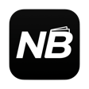
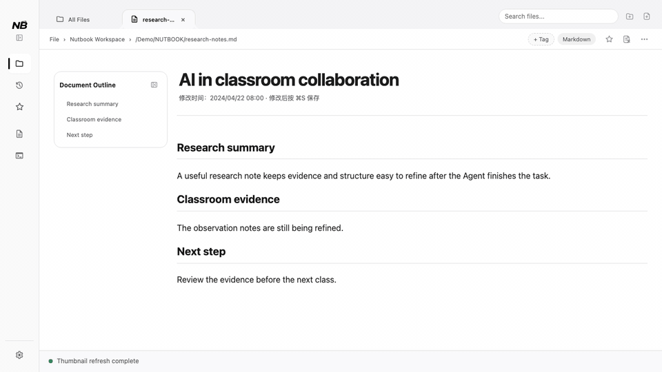
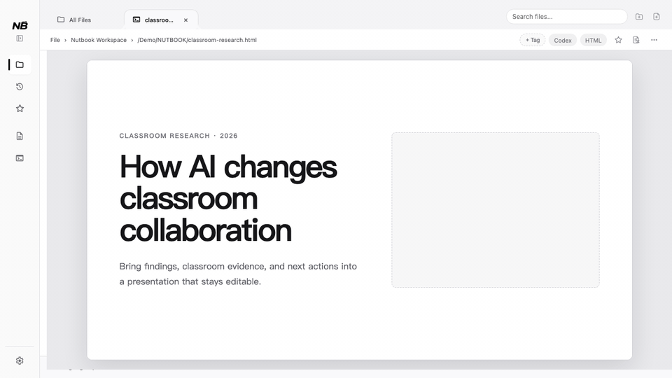
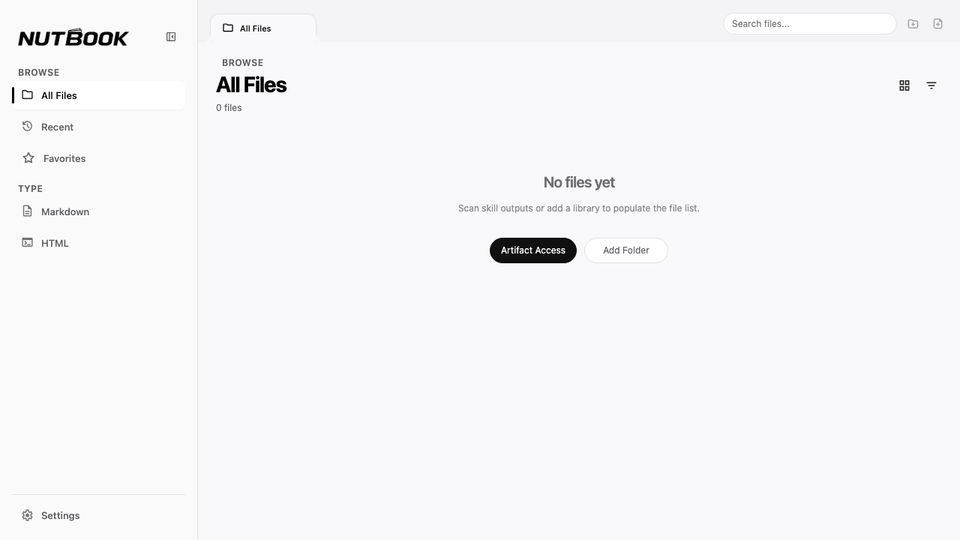

<p align="center">
  <a href="./assets/app-icon.png">
    
  </a>
</p>

<div align="center">

# NUTBOOK

</div>

<div align="center">

**A local reading, management, and presentation tool for AI-generated content.**

</div>

[](https://github.com/Ericonquer/NUTBOOK/actions/workflows/ci.yml) · [Download latest release](https://github.com/Ericonquer/NUTBOOK/releases/latest) · [中文版](./README-CN.md)


<https://github.com/user-attachments/assets/45dcfef4-44c4-4ec1-888a-c47404995a72>

## What Is NUTBOOK?

AI no longer stops at answering questions in a chat window. It now delivers real files: research reports, course materials, competitor analyses, client proposals, Markdown documents, HTML presentations, and project or task artifacts created by Agents.

Those files often end up scattered across Downloads, project folders, hidden directories, task histories, and Skill output folders. A result may be easy to find when it is first generated, but after more projects and conversations accumulate, it becomes difficult to remember which task created it, where it was saved, or which file is the final version.

NUTBOOK brings these scattered AI artifacts into one local library so they become:

* **Easier to find:** discover and connect useful work across Agents, projects, tasks, Skills, folders, and individual files.

* **Better to read:** recognize content through thumbnails and dedicated Markdown / HTML reading surfaces.

* **Ready to refine:** make lightweight Markdown edits and update text or images in supported HTML artifacts.

* **Ready to present:** preserve the original interaction of HTML pages and use them in meetings, proposals, classes, and reviews.

* **Local by default:** the filesystem remains the source of truth; NUTBOOK does not turn your library into a cloud content platform.

In short, NUTBOOK **turns scattered AI files into a local library that is readable, manageable, presentable, and reusable.**

## If Agents Already Show Artifacts, Why Use NUTBOOK?

Agent tools such as Codex can show artifacts beside the current task or conversation. That works well while you are still doing the work. But once tasks, projects, and Agents multiply, finding an older result still requires remembering which conversation produced it and searching through a long history.

The two tools serve different stages:

* **Agent tools organize the generation process:** understand a request, execute work, modify files, and deliver a result.

* **NUTBOOK organizes the resulting artifacts:** bring useful work from different conversations, tasks, projects, and Agents into one local library for later reading, editing, and presentation.

NUTBOOK does not replace Agents or manage their execution. Agent projects and tasks are discovery scopes and sources. The items that enter the library are readable or presentable Markdown / HTML artifacts—not every file in a project.

## Real Situations Where NUTBOOK Helps

### If You Are a Teacher

You may ask an Agent to prepare course notes, classroom examples, or an HTML presentation. The Agent says the files are ready, but they may be buried in a nested project directory or an old task. NUTBOOK can surface those results and let you confirm what enters the library, so you can later read, edit, and present them without searching through conversations or hidden folders again.

### If You Are a Researcher or Student

Paper analyses, literature reviews, experiment notes, and progress reports accumulate throughout a project. NUTBOOK gathers Markdown / HTML material from different tasks, then helps you find it again through thumbnails, tags, sources, and recent activity while continuing to refine it as you read.

### If You Work in Business, Consulting, or Planning

Competitor research, market reports, client proposals, and HTML presentations rarely end when AI generates them. They still need fact checks, wording changes, image replacements, and a clear presentation. NUTBOOK supports that post-generation stage: refine, organize, and present the final material.

### If You Use Several Agents and Content-Generating Skills

Codex, Claude Code, OpenClaw, Hermes, WorkBuddy, and different Skills may put their outputs in different places. NUTBOOK creates a local artifact layer across those sources, so you do not need to understand hidden folders, manifests, or internal project structures to keep useful results.

## How NUTBOOK Handles an AI Artifact

**Discover and connect → Read and lightly edit → Organize → Present and reuse**

1. Find useful results in Agent projects and tasks, Skill output folders, local folders, or individual files.
2. Let the user confirm the exact intake scope instead of silently importing an entire project.
3. Read Markdown or run interactive HTML in NUTBOOK, then make the necessary lightweight edits.
4. Organize content through thumbnails, tags, favorites, sources, and recent activity.
5. Reopen, present fullscreen, or reuse the artifact in a meeting, class, proposal, or review.

## Core Capabilities

### 1. Multi-Source Artifact Access

NUTBOOK manages AI artifacts worth reading and presenting—not every file in a project.

Current intake paths include:

* Add a local folder or one Markdown / HTML file.

* Scan declared or commonly used output folders from content-generating Skills.

* Discover Agent project and task artifacts from Codex, Claude Code, OpenClaw, Hermes, and WorkBuddy.

* Use an nbskill manifest to retain artifact identity, provenance, lifecycle, and supported HTML editing capabilities.

* Enable explicitly confirmed Agent integrations so Agents can register artifacts through the shared protocol.

* Use the Nutbook CLI to add or remove a file, folder, or Agent project whether the desktop app is running or closed.

### 2. Markdown / HTML Reading and Lightweight Editing

NUTBOOK is not a heavy authoring suite. It focuses on the edits that matter while you are reading generated content.

* Markdown reading, outline, formatting tools, table operations, undo/redo, save, and recovery.

* A dedicated HTML runtime that preserves JavaScript interaction instead of treating runnable HTML as a static document.

* Text and rich-text editing plus image replacement, cropping, movement, and insertion in supported HTML.

* Page navigation for editable presentations and supported vertical HTML artifacts.

* A same-directory `.nutbook-editable.html` copy for ordinary HTML, preserving the original file.

This walkthrough shows Markdown outline navigation, live editing, text formatting, image insertion, and alignment:



### 3. Local Library Management

* Recognize reports, presentations, and long documents through thumbnails.

* Organize content with favorites, custom tags, Skill tags, and type tags.

* Browse all files, recent items, favorites, content types, and sources.

* Manage folder, single-file, and Agent-project sources separately.

* Treat files on disk as the source of truth and synchronize external additions, changes, and deletions.

### 4. HTML Presentation

* Preserve the page's own JavaScript interaction and visual behavior.

* Present HTML in window-level fullscreen.

* Support page-owned keyboard navigation, presenter mode, and playback controls.

* Provide deterministic navigation for supported presentation and vertical HTML artifacts.

The goal is not merely to open AI-generated HTML, but to make it useful for explaining, proposing, teaching, and reviewing ideas.

This walkthrough shows native text editing, heading formatting, image-frame insertion, and saving in presentation HTML:



## Current Support

| Area             | Supported today                                                                                           | Boundary                                                                                 |
| ---------------- | --------------------------------------------------------------------------------------------------------- | ---------------------------------------------------------------------------------------- |
| Artifact sources | Individual files, folders, Skill outputs, Agent projects and tasks, nbskill manifests, Nutbook CLI        | Connects readable and presentable artifacts, not every project file                      |
| Agent scope      | Bounded project adapters for Codex, Claude Code, OpenClaw, Hermes, and WorkBuddy                          | Project discovery, Agent detection, and integration health are evaluated separately      |
| File formats     | `.md`, `.markdown`, `.html`, `.htm`                                                                       | NUTBOOK is not a general-purpose file manager                                            |
| Markdown         | Reading, outline, light editing, formatting, tables, history, save, and recovery                          | Milkdown is the primary experience with source-editing fallback retained                 |
| HTML             | Interactive runtime, fullscreen, text/rich-text/image editing, supported page navigation                  | Native editing depends on artifact capabilities; ordinary HTML uses an editable copy     |
| Library          | Thumbnails, favorites, tags, recent items, type filters, source management, external file synchronization | The filesystem is the source of truth; the database is an index and cache                |
| Presentation     | HTML interaction, window-level fullscreen, and page-owned presentation shortcuts                          | NUTBOOK preserves page behavior where possible instead of rewriting arbitrary page logic |
| Data location    | Local files, local index, local integrations                                                              | No cloud sync, online collaboration, or RAG knowledge base                               |

## First-Time Setup

This walkthrough starts from an empty library, enables an Agent integration, and discovers Agent projects and Skill output folders. Its scan results use isolated sample data and contain no real user content:



### 1. Download and Install

1. Open [GitHub Releases](https://github.com/Ericonquer/NUTBOOK/releases/latest) and select the latest version.
2. Choose the build for your Mac: Apple Silicon for M1 / M2 / M3 / M4 and later chips, or Intel for an Intel Mac.
3. Download the DMG, open it, and drag `NUTBOOK` into `Applications`.

### 2. Complete the First macOS Authorization

Current GitHub builds use a complete ad-hoc signature because the project does not yet use a paid Apple Developer ID. On first launch, macOS may say it cannot verify the developer:

1. Open System Settings.
2. Go to Privacy & Security.
3. Find the blocked NUTBOOK notice near the bottom.
4. Choose Open Anyway / Allow.

If macOS reports that NUTBOOK is “damaged” and provides no approval option, report the exact package name instead of removing its quarantine attribute.

### 3. Open Artifact Access from an Empty Library

The first launch opens the empty **All Files** tab. Click **Artifact Access** in the center of the page to open **Settings → Artifact Access**.

The page contains two distinct areas:

* The **Agent Integrations** banner in the upper-right manages, enables, or repairs reliably detected Agent integrations.

* **Project Artifact Access** below discovers suggested, optional, and already connected artifacts from existing Agent projects and tasks.

### 4. Enable an Agent Integration

Select a detected Agent in the upper-right banner, click **Enable Agent Integrations**, and confirm the exact scope in the dialog.

NUTBOOK changes only conservatively detected integrations explicitly selected by the user. It does not modify `PATH`, deploy through symlinks, overwrite files whose ownership cannot be proven, or silently downgrade a newer version.

### 5. Add an Artifact with One Sentence

Return to an integrated Agent and say:

> Add this artifact to NUTBOOK.

The Agent can use nbskill to register artifact identity and editing capabilities, then use the Nutbook CLI when you explicitly ask it to connect the artifact. You do not need to find hidden folders, copy long paths, or understand manifests.

Artifacts with the complete NUTBOOK HTML editing protocol receive native light-editing capabilities. Ordinary HTML without the protocol can still be edited safely through a same-directory editable copy.

### You Can Also Use NUTBOOK Without Agent Integrations

* Discover existing Agent project and task artifacts in **Project Artifact Access**, then confirm them manually.

* Add a local folder directly.

* Add one Markdown / HTML file directly.

* Manage output folders from content-generating Skills under **Skill Artifact Access**.

## More Intake and Runtime Options

### Nutbook CLI

NUTBOOK deploys its bundled CLI into the application data directory but intentionally does not add it to `PATH`:

* macOS: `~/Library/Application Support/com.hayley.nutbook/cli/nutbook`

* Windows: `%LOCALAPPDATA%\com.hayley.nutbook\cli\nutbook.exe`

Each mutating command accepts exactly one path:

```text
nutbook add <path> [--json]
nutbook remove <path> [--json]
nutbook add-project <path> [--json]
nutbook remove-project <path> [--json]
nutbook doctor [--json]
```

`doctor` is read-only. File and folder operations support the same Markdown / HTML formats as NUTBOOK and never delete source files.

### Build from Source

For developers, testers, or anyone who wants a local build.

| Dependency   | Recommended version  | Purpose                                                                   |
| ------------ | -------------------- | ------------------------------------------------------------------------- |
| Node.js      | 18+                  | Install frontend dependencies and build Markdown editor / frontend assets |
| npm          | Bundled with Node.js | Run frontend build scripts                                                |
| Rust / Cargo | stable               | Compile and check the Tauri backend                                       |
| Tauri CLI    | 2.x                  | Run or build the desktop app                                              |

```bash
git clone https://github.com/Ericonquer/NUTBOOK.git
cd NUTBOOK
npm install
npm run build:frontend
cargo check --manifest-path src-tauri/Cargo.toml
```

The Markdown editor build includes a compatibility patch. Do not skip `npm run build:frontend`.

For a desktop development run, use the tracked entry point:

```bash
npm run dev
```

This invokes `cargo tauri dev` with `src-tauri/tauri.dev.conf.json`, which gives
the development app the `com.hayley.nutbook.dev` identity, the `NUTBOOK Dev`
display name, and no Markdown/HTML file associations. A bare `cargo tauri dev`
cannot be transparently rewritten by a repository package script; it reads the
release base config and can register the release identity with LaunchServices.
Use `npm run dev` whenever running the debug app.

### Thumbnail Engine

When a usable thumbnail engine is available, NUTBOOK uses it to generate HTML / Markdown thumbnails. Otherwise the app displays placeholders and lets you detect available engines, explicitly enable system Chrome as a fallback, or follow the installation guidance for a screenshot engine. NUTBOOK does not invoke Chrome silently.

## Keyboard Shortcuts

Use `Cmd` on macOS and `Ctrl` on Windows / Linux.

### General

| Shortcut               | Action           | Context                                         |
| ---------------------- | ---------------- | ----------------------------------------------- |
| `Cmd/Ctrl + O`         | Add folder       | Connect a local directory to NUTBOOK            |
| `Cmd/Ctrl + Shift + O` | Add one file     | Connect one Markdown / HTML file                |
| `Cmd/Ctrl + R`         | Rescan library   | Synchronize additions, deletions, and changes   |
| `Cmd/Ctrl + B`         | Toggle sidebar   | Expand or collapse the left navigation          |
| `Cmd/Ctrl + 1`         | All Files        | Switch to the complete library                  |
| `Cmd/Ctrl + 2`         | Recent           | Switch to recently used content                 |
| `Cmd/Ctrl + 3`         | Favorites        | Switch to favorite content                      |
| `Cmd/Ctrl + Shift + B` | Markdown outline | Show or hide the outline while reading Markdown |

### Markdown Reading and Lightweight Editing

| Shortcut               | Action                       | Notes                                        |
| ---------------------- | ---------------------------- | -------------------------------------------- |
| `Cmd/Ctrl + Z`         | Undo                         | Undo the latest Markdown edit                |
| `Cmd/Ctrl + Shift + Z` | Redo                         | Restore the latest undone edit               |
| `Cmd/Ctrl + Y`         | Redo                         | Common Windows / Linux habit                 |
| `Cmd/Ctrl + X/C/V/A`   | Cut, copy, paste, select all | Use native text editing behavior             |
| `Enter`                | Apply link                   | Confirm the current link input               |
| `Esc`                  | Close link input             | Cancel link editing and return to the editor |

Bold, italic, inline code, strikethrough, links, headings, and table operations are handled mainly through the floating toolbar in the reading area.

### HTML Presentation

| Shortcut  | Action                        | Notes                                                     |
| --------- | ----------------------------- | --------------------------------------------------------- |
| `F`       | Toggle fullscreen             | Enter or exit window-level fullscreen in the HTML runtime |
| `S`       | Trigger presenter mode        | For artifacts whose own page supports presenter mode      |
| `←` / `→` | Previous / next page          | Forwarded to the current HTML page                        |
| `↑` / `↓` | Previous / next step          | Exact behavior is defined by the page                     |
| `Space`   | Next step or playback control | For pages that support Space                              |

HTML shortcuts are prioritized for the currently open page. While editing text, NUTBOOK protects input from bare `f/F` presentation shortcuts.

## Product Boundaries

NUTBOOK remains deliberately focused:

* Its core is local reading, management, and presentation of AI artifacts—not a heavy knowledge base.

* It does not aim to provide complex collaboration, cloud sync, or RAG.

* It does not replace AI tools; it receives and organizes the content they generate.

* Agent projects and tasks are artifact sources, not execution workflows managed by NUTBOOK.

* HTML editing is limited to content refinement, not arbitrary page building, responsive layout reconstruction, or general code editing.

* It is best suited to personal local workflows and lightweight sharing or presentation in small teams.

NUTBOOK is closer to an “AI artifact desk” and local presentation library than a team content platform or development IDE.

## Release Highlights

### 1.0.0: First Stable Release

NUTBOOK 1.0.0 brings together local artifact intake, Markdown / HTML reading and light editing, and presentation.

* Open Markdown or HTML from the system into a temporary session, then explicitly add it to the library when needed.
* Connect folders through a preview and synchronize external file changes.
* Use contextual native menus for file actions, text editing, document search, and closing tabs.
* Use Chinese or English application labels in native file, folder, and image dialogs. System-owned controls follow the operating system's application language settings.
* nbskill registration succeeds quietly and coalesces intermediate edits before delivery. Explicit CLI intake remains separate from manifest registration.

DeepSeek Harness integration is deferred to a later version.


### 0.8.0: From Finding Files Manually to Agent Project and Task Artifacts

Version 0.8.0 lets NUTBOOK receive Agent-created work more directly while keeping every modification explicit and local:

* Discover project and task artifacts through bounded adapters for Codex, Claude Code, OpenClaw, Hermes, and WorkBuddy.

* Review suggested, optional, and already connected artifacts before intake.

* Preserve artifact identity, provenance, lifecycle, and HTML editing capabilities through nbskill manifests.

* Enable, repair, manage, or remove verified Agent integrations through one confirmation flow.

* Add or remove files, folders, and Agent projects through the Nutbook CLI, with a read-only health check.

* Retain the non-nbskill discovery path so enhanced integration never becomes a single point of failure.

### 0.6.0: From HTML Presentation to Lightweight HTML Editing

Version 0.6.0 added light editing for supported AI-generated HTML while preserving the original artifact and page behavior:

* Edit plain text and rich text inside the HTML runtime.

* Replace, crop, move, and insert images with undo and redo.

* Navigate editable presentation pages and supported vertical content.

* Save, close, and reopen through a session-validated save flow.

* Create a same-directory `.nutbook-editable.html` copy for ordinary HTML instead of rewriting the original.

## Development Progress and Roadmap

| Status    | Direction                                  | Milestone or goal                                                                                                                   |
| --------- | ------------------------------------------ | ----------------------------------------------------------------------------------------------------------------------------------- |
| Shipped   | **Markdown light editing**                 | Refine generated Markdown while reading, with formatting, tables, history, save, and recovery.                                      |
| Shipped   | **HTML light editing**                     | Update supported text, rich text, and images while preserving the original artifact and page behavior.                              |
| Shipped   | **Agent project and task artifact access** | Expand from files, folders, and Skill outputs to discovery, confirmation, and source management for Agent work.                     |
| Shipped   | **Agent integrations**                     | Register artifact identity, lifecycle, and HTML editing protocols through nbskill while managing only verified Agent installations. |
| Shipped   | **Nutbook CLI**                            | Add or remove files, folders, and Agent projects while the desktop app is running or closed, with a read-only health check.         |
| Next      | **Markdown export center**                 | Export Markdown as reading-oriented or presentation-oriented HTML, then extend toward PDF, long images, and watermarking.           |
| Next      | **Native HTML presentation mode**          | Provide a NUTBOOK-controlled presentation surface with deterministic navigation and stable behavior.                                |
| Next      | **Presentation drawing tools**             | Add temporary on-screen annotation for classes, meetings, proposals, and reviews.                                                   |
| Exploring | **AI-assisted capabilities**               | Help users discover, understand, and refine content after local file safety and deterministic editing boundaries are clear.         |

Every stage supports one goal: make AI artifacts easier to find, understand, refine, explain, and use again—not merely generate once.

## FAQ

**Is NUTBOOK a knowledge base?**

No. The current product focuses on discovering, reading, lightly editing, organizing, and presenting local AI artifacts.

**Can it manage ordinary files?**

You can connect local folders and individual files, but the supported formats and product focus remain Markdown / HTML artifacts generated by AI workflows.

**Does enabling an Agent integration import the whole project?**

No. An Agent project is a discovery scope. NUTBOOK only presents candidates within the artifact boundary and connects them after user confirmation.

**Can every HTML page be edited directly?**

Ordinary HTML can use an editable-copy path that preserves the original. Artifacts with the complete NUTBOOK editing protocol can be edited natively. NUTBOOK does not promise visual editing of arbitrary page layouts or scripts.

**Is it ready for large-scale team collaboration?**

Not currently. NUTBOOK is better suited to personal local workflows or lightweight use in small teams.

**How does it relate to AI tools?**

AI tools generate and modify content. NUTBOOK receives the resulting work so it can be discovered, connected, read, categorized, favorited, lightly edited, and presented.

## License

NUTBOOK is licensed under the Apache License 2.0. See [LICENSE](./LICENSE) for details.

Third-party dependency notices are listed in [THIRD\_PARTY\_LICENSES.md](./THIRD_PARTY_LICENSES.md).
