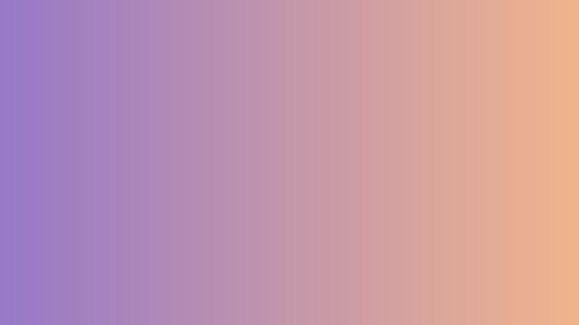
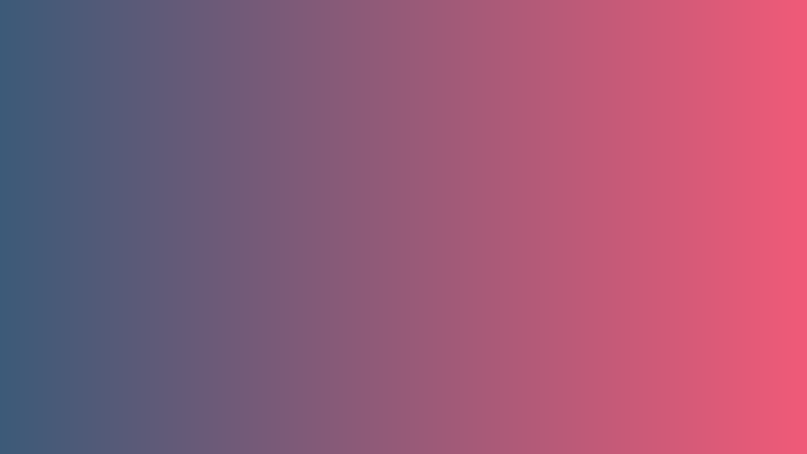
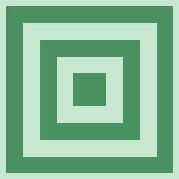
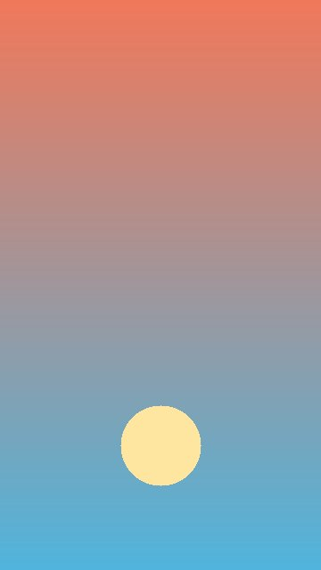
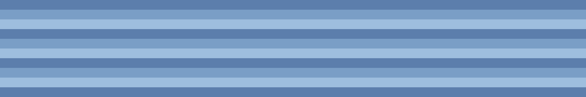

# Cover image document

本文档是 PR C / Task C0 的主样本：验证 canonical comment marker 与各类图片语法在当前产品中的基线行为，不预实现任何封面语义。

<!-- nutbook-cover -->

## 普通独立图片块（4:3 合法边界横图）

## 带链接的独立图片块

## 安全本地 SVG（2:1 合法边界）

## 不安全 SVG（当前仅作普通正文图片）

## 伪 MIME 与像素超限资源（当前仅作普通正文图片）

## 无效比例对照（方图 / 竖图 / 极宽图）

## 说明

`<!-- nutbook-cover -->` 在当前产品中只是普通 HTML comment，以上图片在当前产品中都只是普通正文图片，不会产生任何封面 UI，也不会改变卡片默认封面。图片矩阵：4:3 与 2:1 为合法横图边界（PNG/SVG）；方图、竖图、超 2:1 极宽图为比例负面样本；伪 MIME 仅扩展名与 magic 不一致、像素超限图仅尺寸超限，均保持 16:9 合法比例，确保未来 C2 校验一次只拒绝一个条件。
